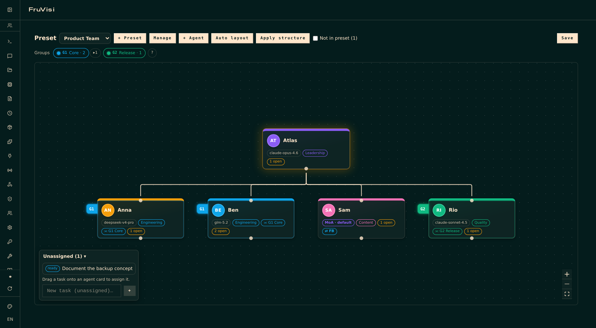

# FruVisi

> Visual organization dashboard for [Hermes Agent](https://hermes-agent.nousresearch.com) — structure your agents like an org chart, switch whole team lineups with one click, distribute kanban tasks by drag & drop, and control it all from chat.

FruVisi adds an interactive 2D org chart to the Hermes dashboard. Agents are native Hermes profiles (single source of truth) — FruVisi only adds the organizational layer on top: reporting lines, areas, groups, presets per project, an OpenRouter fallback per agent, and a delegation export that feeds your drawn structure into Hermes' native kanban routing.



## Features

- **Org chart** built on React Flow: freely placeable cards (avatar, display name, model/MoA-preset badge, area color), reporting lines drawn between handles with cycle protection, auto layout (dagre), position swap, pins, a board that grows with your org
- **Native profiles as single source of truth** — FruVisi never duplicates agent data; MoA agents show their selected MoA preset on the card
- **Agent wizard**: create real Hermes profiles from the chart (name with free capitalization, title, area, parent, group, fixed model or MoA preset, optional lean profile without default skills, optional OpenRouter fallback)
- **Areas & groups**: free-form colored labels; groups get stable numbers (main groups G1, G2 …, subgroups G2.1 with shaded family colors) and render as tabs on the card edge — plus a group bar above the board with search and a spotlight that highlights members on hover. Both renamable without losing any assignments
- **Functional presets**: multiple named lineups per use case, switchable and fully isolated. Switching a preset writes active/INACTIVE markers into the profile descriptions — the exact routing signal Hermes' kanban decomposer reads — so only the active preset's cast receives work. Agents outside the preset live in a "not in preset" bar and rejoin by drag & drop
- **OpenRouter fallback per agent**: one checkbox in the wizard and the detail panel, with a configurable default model (OpenRouter presets like `@preset/…` work too, both as fallback and as main model). Cards show a "⇄ FB" badge when a fallback is set; agents that already run on OpenRouter hide the option automatically. Kicks in on rate limits, overload and connection errors
- **Top agent**: explicitly designated (golden aura instead of guesswork) — cutting lines never promotes anyone by accident; replace only via swap or by releasing the role
- **Kanban integration**: task badges per agent, an unassigned-task dock with drag-to-assign, quick task creation, per-agent task list — all through the native Hermes kanban API (no separate task store)
- **Delegation export** ("Apply structure"): writes hierarchy, area and group notation into the profile descriptions; your own description text is preserved
- **Chat control**: a deliberately lean set of six operational agent tools for all Hermes gateways (Telegram, Discord, …) — overview, list/switch presets, add/remove preset members (with immediate sync), apply structure. Speak naturally ("switch the FruVisi preset to project X"); the model picks the tool
- **Single-language English UI**, light/dark theme aware (follows the dashboard theme)

## Requirements

- Hermes Agent **v0.15+** with dashboard plugin support (tested against **v0.18.2**)
- Works with the official Docker image (`/opt/data` mount) and native `~/.hermes` installs
- For the fallback feature: `OPENROUTER_API_KEY` in the instance's env

## Installation

### Via the Hermes CLI (recommended)

Hermes ships a Git-based plugin installer — one command, no clone needed:

```bash
hermes plugins install Fruxano/fruvisi/plugin --enable
```

Then restart the dashboard (API routes and agent tools mount at startup). Update later with `hermes plugins update fruvisi`.

**Docker** (official image): run the same command inside the container as the Hermes user, then restart:

```bash
docker exec -u 10000 -e HOME=/opt/data <container> \
  hermes plugins install Fruxano/fruvisi/plugin --enable
docker restart <container>
```

`10000` is the Hermes UID in the official image — verify with `docker exec <container> stat -c %u /opt/data`.

### Installer script (alternative, with backup)

Prefer a guided install that backs up your config, profiles and plugins first? Clone or download this repo onto your server and run:

```bash
sudo bash release/install.sh
```

The script auto-detects Docker vs. native installs, creates the backup, copies the plugin, sets ownership container-side, enables it (`hermes plugins enable fruvisi`) and restarts the dashboard. **Docker note:** the restart briefly takes the whole Hermes container offline.

### Manual

1. Copy `plugin/` to `<HERMES_HOME>/plugins/fruvisi/` (Docker: the host path of the `/opt/data` mount) and chown to the Hermes user.
2. `hermes plugins enable fruvisi`
3. Restart the dashboard (API routes and agent tools mount at startup).

## Usage

Open the dashboard → sidebar → **Plugins → FruVisi**.

- **Structure**: drag an edge from a card's bottom handle onto another card to set "reports to"; click a line to remove it; the detail panel offers the same as dropdowns.
- **Presets**: create, duplicate, rename and delete lineups under *Manage*; switching writes the active/INACTIVE markers into the profile descriptions (can be disabled there too). "Create empty" starts without members — drag agents in from the "not in preset" bar.
- **Fallback**: set a default fallback model under *Manage* (e.g. an OpenRouter preset), then enabling a fallback per agent is a single checkbox.
- **Top agent**: select a card → "👑 Set as top agent". The role only changes via swap or by releasing it — never by cutting lines.
- **Groups/areas**: create, rename (✎) and remove them under *Manage*, assign via the detail panel; hover a group chip for the spotlight.
- **Tasks**: drag tasks from the dock onto cards to assign; create tasks per agent in the detail panel or unassigned in the dock.
- **Apply structure**: writes the chart into the profile descriptions (marked block, your own text preserved). From then on, prompting your orchestrator distributes kanban tasks along your drawn structure.
- **Chat**: "show me my FruVisi organization", "switch the preset to project X", "remove dev-anna from the preset" — works on every connected gateway. Mentioning "FruVisi" or "org chart" helps tool selection for ambiguous words like "group".

## How it works

| Layer | What FruVisi does |
|---|---|
| Dashboard plugin | React IIFE bundle (React from the Hermes plugin SDK, React Flow + dagre bundled), FastAPI backend for the topology store |
| Agent tools | Registered via the plugin `register(ctx)` entry point — deliberately only six operational tools (every registered tool costs system-prompt tokens on each turn). They follow the same rules as the UI: pinned agents are protected, and removing an agent from the preset releases its subordinates and the top-agent role. Structural edits (lines, groups, top agent) are UI-only by design |
| Data | Everything FruVisi owns lives in `<HERMES_HOME>/fruvisi/topology.json` (atomic writes). Agents, kanban and models stay native |
| Native writes | Only through official Hermes functions, only on user action: profile creation (wizard), profile descriptions (apply structure / preset sync), kanban assignments — and, as the single documented config exception, the `fallback_providers` key in a profile's config.yaml for the fallback feature (written via Hermes' own load/save path, same as the native model endpoint) |

## Security & transparency

- No shell calls, no eval, no reading of keys/secrets, no external network requests, no telemetry
- Frontend is fully bundled (no CDN loading); API calls use the dashboard's own session auth
- FruVisi's only own write surface is `topology.json`; native writes are listed above, uninstalling leaves the Hermes core untouched
- Like every Hermes plugin with a backend, the code runs inside the dashboard/agent process — install plugins you trust and keep `allow_tool_override: false` (FruVisi never asks for it)

## Development

```bash
npm install
npm run build          # src/ → plugin/dashboard/dist/ (esbuild, IIFE, React external)
cd docker && docker compose up -d   # local Hermes 0.18.2 with the plugin mounted
```

Set your own basic-auth credentials in the fresh `docker/hermes-data/config.yaml` (see `docs/api-findings.md`). UI changes: authenticated `GET /api/dashboard/plugins/rescan`. Backend/tool changes: restart the container. See `docs/api-findings.md` for verified Hermes API notes and pitfalls.

## Uninstall / rollback

```bash
hermes plugins remove fruvisi     # or: hermes plugins disable fruvisi (keeps the files)
rm -rf <HERMES_HOME>/fruvisi      # optional: chart data
# restart the dashboard
```

## Roadmap

- Live activity on cards (lifecycle hooks: which agent is working right now)
- Role presets: skill set + working directory per role, so a new agent is one click and lean by default
- Long term: spatial view (2.5D/3D)

## Acknowledgments

Built on [Hermes Agent](https://hermes-agent.nousresearch.com) by Nous Research, [React Flow](https://reactflow.dev) and [dagre](https://github.com/dagrejs/dagre).

## License

MIT
